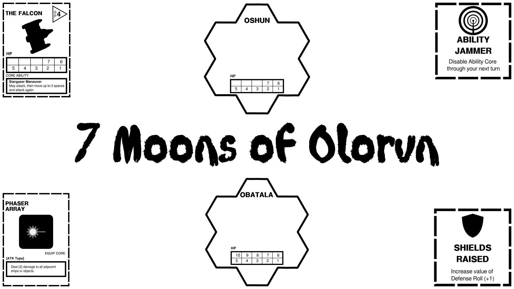

Title: 7 Moons of Olorun
Date: 2023-03-24 00:56
Author: kevin
Slug: 7-moons
Status: published

### Now Playtesting

It’s 2419. The planet of Olorun is a powerful, wealthy, and collectivist independent world nation.  The Galactic Federation has extended an invitation to Olorun to join the empire. Some Olorunians assume they want the planet’s rich natural resources to restore their glory. Others believe they should join the Galactic Federation and reform it to create a better galaxy. As Vice Admirals re-enter the lunar space near their planet, they learn that Federation forces have secretly established automated tactical defense outposts on each of their seven moons while they were in negotiations. Several Vice Admirals have command of fleets of 8 ships in charge of neutralizing these outposts. Careful! The outposts, while still in early stages, have powerful armaments. There are also rumors of Federation sympathizers among Olorunians who helped establish the  outposts for their own purposes.

Battle for the consciousness of planet Olorun in solo, cooperative, or competitive play in this Afro-futurist space board game for 1–4 players. Answer the question: “Are we responsible for all of our people or all people when the universe is filled with those who care only for themselves?”

**Keep an eye on the Syzygy SF Calendar for playtesting Dates**
 
[Syzygy SF, a San Francisco Arts Co-op](https://www.syzygysf.com/)
 
[Direct Link to Syzygy Google Calendar](https://calendar.google.com/calendar/u/0?cid=NjVuNWJlaDZ0bGx1b3RyMHFzZjVmbG9jN3NAZ3JvdXAuY2FsZW5kYXIuZ29vZ2xlLmNvbQ)

