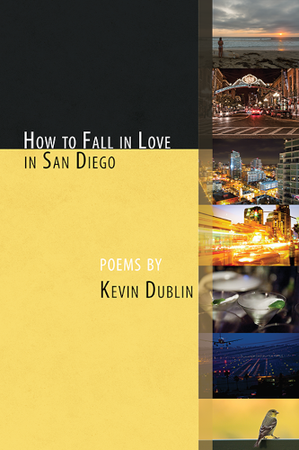

Title: How to Fall in Love in San Diego
Slug: how-to-fall
Summary: Chapbook How to Fall in Love in San Diego by Kevin Dublin
Lang: en

How to Fall in Love in San Diego (Finishing Line Press, 2017) is a chapbook of 26 love & anti-love poems. The poems are set inside, around, and far outside the bounds of San Diego, CA. They’re a collective attempt to encapsulate the city’s energy as well as the universal, sometimes heart-wrenching, 21st century search for love or something similar. You can order a copy of the chapbook from [Finishing Line Press](https://www.finishinglinepress.com/product/how-to-fall-in-love-in-san-diego/), from [Bookshop.org](https://bookshop.org/books/how-to-fall-in-love-in-san-diego/9781635342260), an audiobook version of me reading it on [Amazon](https://www.amazon.com/How-Fall-Love-San-Diego/dp/B07GL53Z9P/), or ask for it to be ordered to any local book store.

## Praise for *How to Fall in Love in San Diego*

> “Kevin Dublin’s debut has some of the most beautiful love poems I have read this year, which is to say these are poems of heart-break and the knowledge that comes after, poems of play and the excitement that comes with, poems of surprise and the astonishment that stays. “Pretend you are here / for a wedding” the poet tells us, “—unless you are here for a wedding.” There is so much fun in these pages that you know pain is real, there is so much feeling in the images, in the tonalities, in the sexiness of warning (that attraction transcends most sanity), in lips (each a strawberry perfectly split open), in silences (when a lover sleep-rhymes words that don’t rhyme), in dreams (that teach carousels are the best place for orgasms). Beware. These poems bewitch. You might just fall in love.”

–[Ilya Kaminsky](http://www.ilyakaminsky.com/), author of *Deaf Republic*

> “Kevin Dublin is a new poet whose open-hearted songs of praise remind me of Whitman, O’Hara, and Ross Gay. *How to Fall in Love in San Diego* is a collection of remarkable formal variety, encompassing received forms, nonce forms, and what feels like a truly original improvisatory style with grace and confidence. It is also a collection of tonal and even spiritual variety: it can be as giddy and inclusive as one of the *Lunch Poems*, as forcefully engaged with the world as *Citizen*, or as transcendent and magisterial as Wordsworth:

> even as the world beyond ashes and burns.
> May we wake each morning and remember it.

> I look forward to more from this wonderful poet. In *How to Fall in Love in San Diego*, Dublin develops a redemptive art that charms even as it restores us to our own better selves.”

–[Michael White](http://www.michaelwhitepoet.com/), author of *Travels in Vermeer*

> “Kevin Dublin’s *How to Fall in Love in San Diego* is synaptic, prowling dangerous borderlands between our nearly inarticulate sorrows and the ineffable. These poems commune with desire and desertion, limn betrayal and tally up the damage. The epiphanies are nearly numinous: “Goodbye reminds me / to mean what you put your mouth on / whether it’s words or the silent parts of a body.”

–[John Hoppenthaler](https://www.connotationpress.com/hoppenthaler-s-congeries), author of *Domestic Garden*

## Poems from *How to Fall in Love in San Diego*

<iframe width="560" height="315" src="https://www.youtube.com/embed/_RDZDKXK_JY?list=PL69zjcOF2crMt3cn7WQdTq5LshUFI58qH" title="YouTube video player" frameborder="0" allow="accelerometer; autoplay; clipboard-write; encrypted-media; gyroscope; picture-in-picture" allowfullscreen></iframe>

