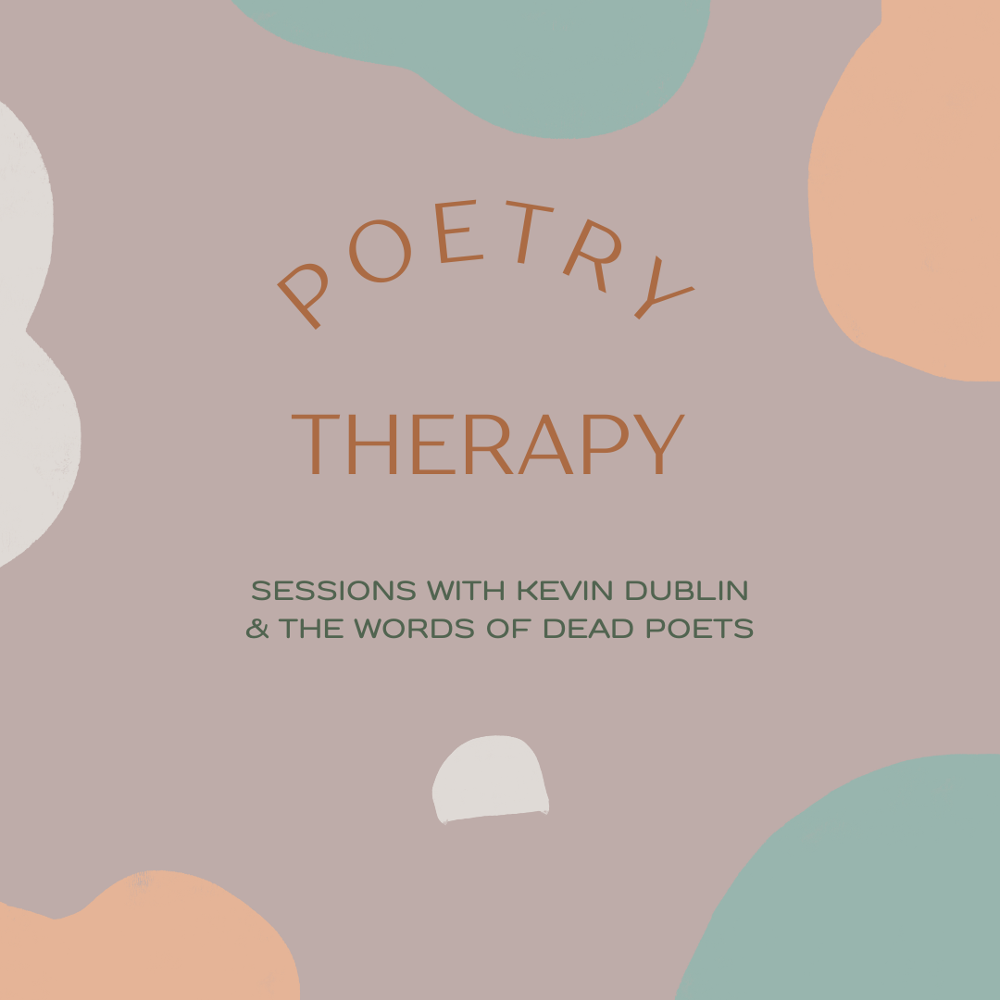

Title: Poetry Therapy
Slug: poetry-therapy
Summary: Therapy and Poetry for the soul read by Kevin Dublin.
Lang: en

## Poetry Therapy Sessions

"A time comes when death doesn't help," the Brazilian poet Carlos Drummond de Andrade once wrote. For me, poetry was the remedy in those times. Those "times of total cleaning up" or any time of deep feeling full of questions or adrenaline-fueled worry. 

*Poetry Therapy* is a session where a poet listens to anything you need to say or get off of your chest which you might not feel comfortable saying to anyone else. After deep listening, the poet searches their mind for a poem and either shares the words of a poet who has left this world or writes you an original poem to recite or both as well as providing you with a writing prompt to explore what you are feeling.

Sessions are held either in-person, over video chat, or asynchronously via email or voicemail. In-person sessions are only [held at pop up events](../pages/events.html), including at Golden Gate Park in San Francisco until 2023 (the first day on Oct 21 at 1 PM). You can [order an asynchronous session in the shop](https://kevindublin.com/pages/shop.html) or below.

	<form target="paypal" action="https://www.paypal.com/cgi-bin/webscr" method="post">
		<input type="hidden" name="cmd" value="_s-xclick">
		<input type="hidden" name="hosted_button_id" value="Q9VX256MWLDVG">
		<input type="image" src="https://www.paypalobjects.com/en_US/i/btn/btn_cart_SM.gif" border="0" name="submit" alt="PayPal - The safer, easier way to pay online!">
		
	</form>

After placing an order, you will receive instrucions on how to share. You can say your name and where you're from or remain anonymous. Please specify in your order how you'd like to receive your poem and prompt. You can also opt for me to give you a call back or send simply as text.

<iframe width="100%" height="166" scrolling="no" frameborder="no" allow="autoplay" src="https://w.soundcloud.com/player/?url=https%3A//api.soundcloud.com/tracks/1362176284&color=%23ff5500&auto_play=false&hide_related=false&show_comments=true&show_user=true&show_reposts=false&show_teaser=true"></iframe>
<a href="https://soundcloud.com/kevdublin" title="kevdublin" target="_blank" style="color: #cccccc; text-decoration: none;">kevdublin</a> · <a href="https://soundcloud.com/kevdublin/your-shoulders-hold-up-the-world-by-carlos-drummond-de-andrade" title="Your Shoulders Hold Up the World by Carlos Drummond de Andrade" target="_blank" style="color: #cccccc; text-decoration: none;">Your Shoulders Hold Up the World by Carlos Drummond de Andrade</a>

  
**Your Shoulders Hold Up the World** | [*Carlos Drummond de Andrade*](https://www.britannica.com/biography/Carlos-Drummond-de-Andrade)

A time comes when you no longer can say:  
     my God. 
A time of total cleaning up. 
A time when you no longer can say: my love. 
Because love proved useless. 
And the eyes don’t cry. 
And the hands do only rough work. 
And the heart is dry.  

Knuckles knock at your door in vain, you won’t open. 
You remain alone, the light turned off, 
and your enormous eyes shine in the dark. 
It is obvious you no longer know how to suffer. 
And you want nothing from your friends.  

Who cares if old age comes, what is old age? 
Your shoulders are holding up the world 
and it’s lighter than a child’s hand. 
War, famine, family fights inside buildings 
prove only that life goes on 
and not everybody has freed themselves yet. 
Some (the delicate ones) judging the spectacle cruel 
will prefer to die. 
A time comes when death doesn’t help. 
A time comes when life is an order. 
Just life, with no escapes.

*I am not an art therapist, just an empath poet who has experienced trauma, reads a lot of poetry, cares about the mental well-being of others, and has witnessed the transformative power of prescriptive art and practice*
