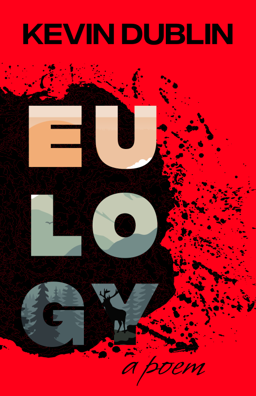

Title: Shop
Slug: shop
Summary: Online merchandise related to or by Kevin Dublin, including How to Fall in Love in San Diego and other books.
Lang: en

Payment available via PayPal.

	

		

			

				<figure class="image">
					
				</figure>
			

			

				 
How to Fall in Love in San Diego - $10

				

					<form target="paypal" action="https://www.paypal.com/cgi-bin/webscr" method="post">
						<input type="hidden" name="cmd" value="_s-xclick">
						<input type="hidden" name="hosted_button_id" value="7ZQAWYSRQKJ2N">
						<input type="image" src="https://www.paypalobjects.com/en_US/i/btn/btn_cart_SM.gif" border="0" name="submit" alt="PayPal - The safer, easier way to pay online!">
						
					</form>
				

			

		

	

	

		

			

				<figure class="image">
					
				</figure>
			

			

				 
Eulogy [Pre Order] - $6

				

					<form target="_blank" action="https://ravenandwrenpress.com/raven-wren-bookstore/" method="get">
						<input type="submit" style="background-color: #FEC439; border: none; color: black; border-radius: 8px; text-align: center; font-weight: bold; cursor: pointer; padding: 5px 20px; font-size: 12px;" name="submit" alt="pre order button" value="Pre Order">
					</form>
				

			

		

	

	

		

			

				<figure class="image">
					
				</figure>
			

			

				 
Poetry Therapy Session [asynchronous] - $25

				

					<form target="paypal" action="https://www.paypal.com/cgi-bin/webscr" method="post">
						<input type="hidden" name="cmd" value="_s-xclick">
						<input type="hidden" name="hosted_button_id" value="Q9VX256MWLDVG">
						<input type="image" src="https://www.paypalobjects.com/en_US/i/btn/btn_cart_SM.gif" border="0" name="submit" alt="PayPal - The safer, easier way to pay online!">
						
					</form>
				

			

		

	

